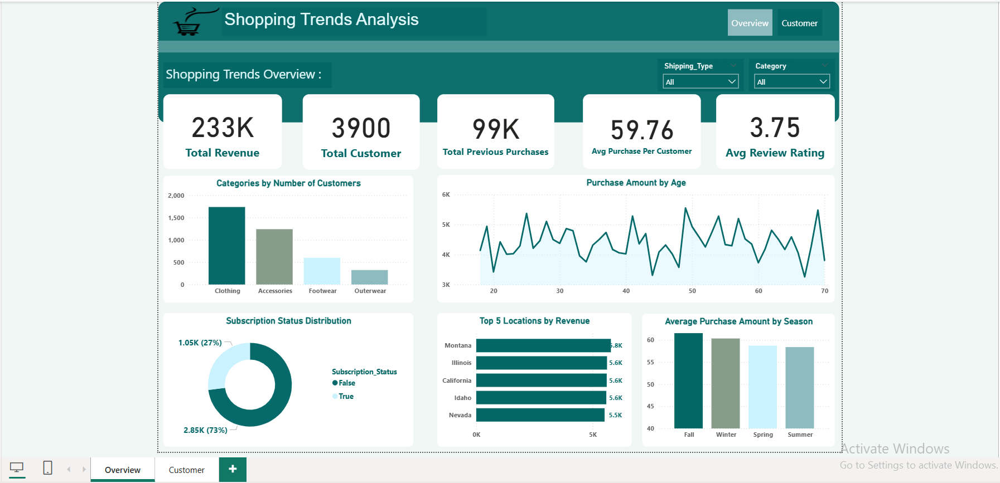
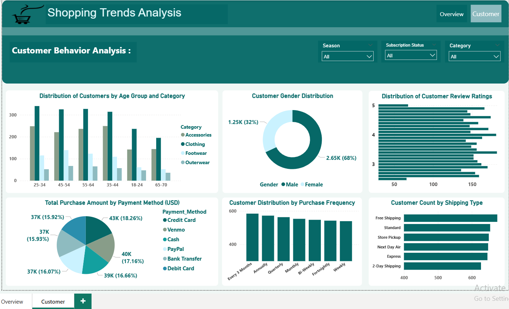

# End-To-End Data Analysis Project 📊

## Snapshots

| Dashboard 1 - Shipping & Review | Dashboard 2 - Customer Analysis |
|-------------------------------|-------------------------------|
|  |  |

---

## Overview
This project represents a complete **end-to-end data analysis** pipeline. It starts from **loading the dataset from a SQL database**, performing **data cleaning and preprocessing in Python**, and finally building **interactive dashboards using Power BI** to derive insights.

The dataset includes customer and sales-related information and helps to answer business questions such as:
- Customer distribution by shipping type
- Total orders per customer
- Discounts and review ratings
- And more

---

---

## Tools & Technologies
- **SQL Server / MySQL**: For storing and managing data.
- **Python**: Data extraction, cleaning, transformation.
- **Pandas, NumPy**: For data preprocessing.
- **Power BI**: For building visual dashboards and reports.
- **GitHub**: For version control and project hosting.

---

## Steps Followed

1. **Data Extraction from SQL Database**
   - Connected to the database using Python (`pyodbc` or `sqlalchemy`)
   - Extracted required tables for analysis

2. **Data Cleaning with Python**
   - Checked and handled missing values
   - Converted data types
   - Renamed columns for clarity
   - Created new calculated columns where needed

3. **Exploratory Data Analysis (EDA)**
   - Identified patterns and anomalies
   - Prepared visuals to understand customer behavior

4. **Power BI Dashboard Creation**
   - Built interactive dashboards including:
     - Pie charts
     - Bar charts
     - Tables
     - Filters and slicers
   - Highlighted:
     - Shipping Type preferences
     - Customer order patterns
     - Review and rating distributions
     - Discount patterns

---

